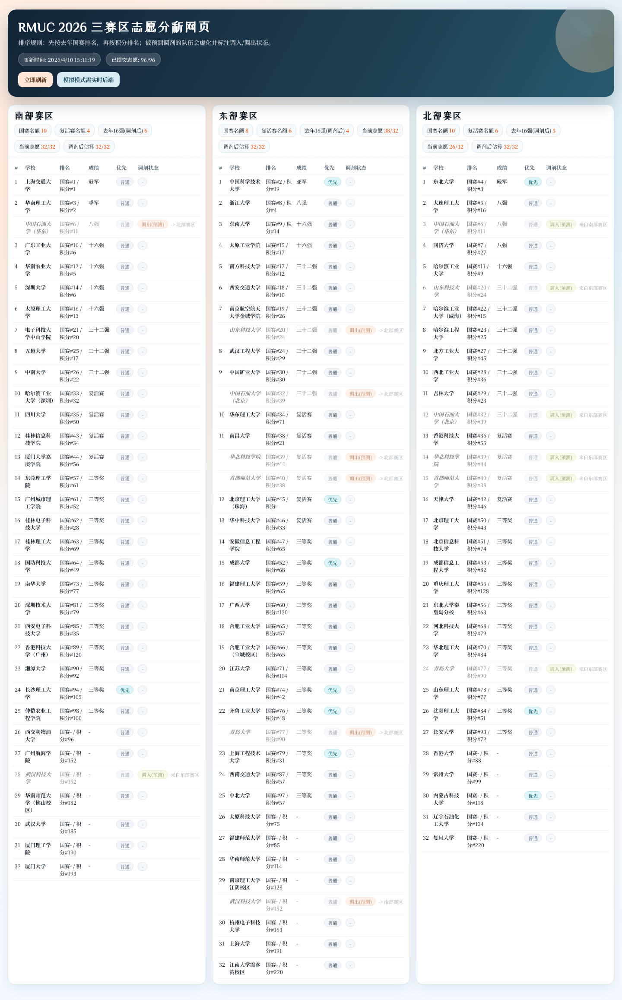

# RMUC 2026 三赛区分析器

## 在线围观入口

若不想自己搭建可以直接访问 GitHub Pages：

[](https://superg258.github.io/wheretogo/)

- https://superg258.github.io/wheretogo/



> 页面实时截图（采集时间：2026-04-10 15-13）

面向 RMUC 三赛区报名态势的实时分析工具，支持网页看板和命令行两种使用方式。

如果你是第一次接触 Python 项目，按下面的「3 分钟上手」一步一步做就能跑起来。

## 你能用它做什么

0. 在闲的没事的时候来一场酣畅淋漓的赛博斗蛐蛐。
1. 实时查看三赛区报名人数与容量压力。
2. 估算国赛名额（基础名额 + 浮动名额）。
3. 估算复活赛名额（模拟值，仅用于态势分析）。
4. 预测可能被调剂的队伍和去向。
5. 在网页里看到“调入/调出(预测)”和虚化展示。
6. 进入模拟模式，手动改动学校赛区后对比“基线 vs 模拟”名额变化。

## 3 分钟上手（新手推荐）

### 1) 安装 Python 环境依赖

```bash
pip install -r requirements.txt
python -m playwright install chromium
```

说明：
1. `playwright install chromium` 不是每次都要执行，首次安装环境执行一次即可。
2. 即使 Playwright 不可用，程序也会先尝试 API 链路抓取。

### 2) 启动网页看板

```bash
python run_web.py
```

然后打开浏览器访问：

```text
http://127.0.0.1:8000
```

### 3) 如果你想看命令行报告

```bash
python run.py --once --config config/config.json
```

## 两种运行方式怎么选

### A. 网页看板（推荐日常使用）

```bash
python run_web.py
```

特点：
1. 页面自动刷新（60 秒）。
2. 直接看到三赛区卡片和学校表格。
3. 支持查看调剂状态（调入/调出预测）。
4. 支持模拟模式：仅针对当前已报名学校手动改赛区并重算。

模拟模式说明：
1. 点击页面右上角「进入模拟模式」。
2. 在模拟面板里添加一条或多条改动：选择学校 + 目标赛区。
3. 点击「应用模拟」，页面会展示“基线结果”和“模拟结果”并排对比。
4. 模拟结果仅当前页面会话有效，不会写回真实报名数据或缓存。
5. 进入模拟模式后会暂停自动刷新；如果点「刷新基线」，需重新应用模拟。

注意：`run_web.py` 默认使用代码内置配置，不会自动读取 `config/config.json`。

如果你希望网页使用 `config/config.json`，请改用：

```bash
PYTHONPATH=src python -c "from rmuc_analyzer.web import create_app; create_app('config/config.json').run(host='0.0.0.0', port=8000, debug=False)"
```

### B. CLI 文本报告（适合日志、服务器）

单次运行：

```bash
python run.py --once --config config/config.json
```

轮询运行：

```bash
python run.py --config config/config.json --interval 60
```

常用参数：
1. `--once` 只运行一轮。
2. `--interval` 轮询间隔秒数。
3. `--max-iterations` 最大轮询次数。
4. `--config` 指定配置文件。

## 第一次配置（建议照抄）

先复制示例配置：

```bash
cp config/config.example.json config/config.json
```

重点改这几个字段：
1. `qingflow_url`：你的青流分享链接。
2. `priority_schools`：你希望保留志愿优先的学校名单。
3. `announcement_local_only`：是否只用本地公告（离线模式）。

## 配置项说明（小白版）

配置文件：`config/config.example.json`

1. `poll_interval_sec`：CLI 默认轮询秒数。
2. `expected_total_teams`：预期报名总队伍数（默认 96）。
3. `capacity_per_region`：每赛区容量（默认 32）。
4. `qingflow_url`：实时报名数据来源。
5. `announcement_urls`：公告链接（1909/1910/1884/1856/1847）。
6. `announcement_local_dir`：本地公告 HTML 存放目录。
7. `announcement_local_only`：
   - `false`：优先联网更新，失败再用本地。
   - `true`：只读本地，不联网。
8. `manual_top16_counts`：手动覆盖 16 强分布（一般留 `null`）。
9. `priority_schools`：你手工维护的优先名单（会和 RMUL 9 个承办院校合并）。
10. `rmu_ranking_csv`：积分榜 CSV 路径。
11. `cache_file`：实时抓取缓存文件路径。
12. `request_timeout_sec`：网络超时时间（秒）。

## 程序规则口径（避免误解）

1. 优先名单来源：`priority_schools` + RMUL 2026 九个承办院校（来自 1903 承办院校名单）；不启用海外优先。
2. 调剂预测只在出现超容量赛区时触发。
3. 国赛与复活赛名额按当前口径实时估算，不代表官方最终结果。
4. 报名未满时，复活赛估算会先做最低约束补齐后再分配。

## 网页字段怎么读

1. `国赛名额`：按规则估算的该赛区国赛晋级数。
2. `复活赛名额`：模拟估算值。
3. `去年16强(调剂后)`：按预测调剂后归属统计。
4. `当前志愿`：当前赛区已报名志愿人数。
5. `调剂后估算`：把预测调剂应用后的人数。
6. `调剂状态`：
   - `调入(预测)`：预测会被调入本赛区。
   - `调出(预测)`：预测会从本赛区调出。

## API 用法

接口：`GET /api/analysis`

本地示例：

```bash
curl http://127.0.0.1:8000/api/analysis
```

返回主要字段：
1. `generated_at`：生成时间。
2. `total_submitted`：当前总报名数。
3. `expected_total`：预期总队伍数。
4. `regions`：三赛区详细数据。
5. `notes`：口径说明与运行提示。

模拟接口：`POST /api/simulate`

请求体示例：

```json
{
   "changes": [
      {"school": "某高校", "to_region": "南部"},
      {"school": "另一高校", "to_region": "东部"}
   ]
}
```

说明：
1. `school` 必须是当前已报名学校。
2. `to_region` 仅支持 `南部` / `东部` / `北部`。
3. 同一学校多次提交时，按最后一次改动生效。
4. 改到原赛区会被忽略（no-op）。

返回字段（成功）：
1. `baseline`：基线 payload（改动前）。
2. `simulated`：模拟 payload（改动后）。
3. `simulation_meta`：本次模拟元信息（生效/忽略/错误条数与明细）。

常见错误码：
1. `400`：请求体不是 JSON 对象，或缺少 `changes` 数组。
2. `422`：改动参数校验失败（学校不存在、赛区非法等）。

## 常见问题（先看这里）

### 1) 网页打不开或端口占用

现象：提示 `Address already in use`。

处理：
1. 停掉旧进程后重启。
2. 或改端口启动（自定义启动命令）。

### 2) 改了 `config/config.json`，网页没变化

原因：`python run_web.py` 默认不读这个文件。

处理：使用上面的自定义启动命令，让网页显式读取配置。

### 3) 抓取失败

程序会按以下顺序回退：

```text
API -> requests文本解析 -> Playwright渲染解析 -> 本地缓存快照
```

如果你需要离线运行：
1. 把公告 HTML 放在 `data/announcements`。
2. 设置 `announcement_local_only=true`。

### 4) 页面里有“空位”

这是设计行为：每赛区固定展示 32 行，便于观察容量缺口。

## 本地测试

```bash
PYTHONPATH=src pytest -q
```

## 项目结构（你最常用）

1. `run_web.py`：网页入口。
2. `run.py`：CLI 入口。
3. `config/config.example.json`：配置模板。
4. `src/rmuc_analyzer/`：核心逻辑代码。
5. `tests/`：单元测试。
6. `scripts/build_static_site.py`：把 Flask 页面离线渲染成静态快照（供 GitHub Pages 托管）。
7. `scripts/deploy_hf_space.py`：一键把 Flask 应用部署到 Hugging Face Space。
8. `deploy/hf_space/`：HF Space 部署所需的 Dockerfile / wsgi.py / requirements.txt / README 模板。
9. `.github/workflows/deploy-pages.yml`：定时重建静态快照并发布到 GitHub Pages。

## 在线部署（给想让别人直接在线看的同学）

这个项目的后端是一个 Flask 应用，每次请求都会实时抓取青流报名数据。因此在线
部署有两条路线，可以单独使用，也可以组合成「静态快照 + 实时后端」的双保险：

### 路线 A：GitHub Pages（30 分钟一快照，适合纯展示）

GitHub Pages 只能托管静态文件、不能跑 Python，所以我们把 Flask 页面离线渲染
成一份静态 HTML + `data.json`，再用 GitHub Actions 定时重建。新数据的落地颗粒度
大约是 **30 分钟**（GitHub 对 cron 的文档最小间隔是 5 分钟，实际还会受平台负载
影响而延迟，真需要更细的颗粒度请走路线 B）。

一次性启用流程：

1. Fork 这个仓库到你自己名下。
2. 在你的 fork 里：`Settings → Pages → Source` 选 **GitHub Actions**。
3. 推任意一个提交（或去 `Actions` 页面点 `Deploy static snapshot to GitHub Pages`
   → `Run workflow`）触发首次构建。
4. 几十秒后访问 `https://<your_github_user>.github.io/<repo_name>/`。

想让快照每 N 分钟自动刷新：不用改代码，`deploy-pages.yml` 里已经写好了
`cron: "*/30 * * * *"`，按需改成 `*/5` 之类即可。想把快照页和你自己的
实时后端（路线 B）联动，在仓库的 `Settings → Secrets and variables → Actions
→ Variables` 里新增一个变量：

- **Name**：`LIVE_URL`
- **Value**：你的 HF Space 的 URL，比如 `https://alice-wheretogo.hf.space/`

下次 Pages 重建时，页面会自动出现一个「⚡ 真·实时版本」按钮指向你的 Space。

### 路线 B：Hugging Face Space（真·实时，每次请求现抓）

Hugging Face Space 的 Docker SDK 可以直接跑常驻 Flask 进程，免费、无需信用卡、
不会像 Render 那样冷启动，是这个项目的推荐部署方式。

一次性启用流程：

1. 注册 <https://huggingface.co/> 账号。
2. 在 <https://huggingface.co/settings/tokens> 创建一个 `Write` 权限的 token。
3. 在本地仓库目录执行（把 `your_username` 换成你自己的 HF 用户名）：

   ```bash
   pip install huggingface_hub
   export HF_TOKEN=hf_xxxxxxxxxxxxxxxxxxxx
   python scripts/deploy_hf_space.py --space your_username/wheretogo
   ```

   脚本会：自动创建 Docker Space → 把 `src/` + `config/` + `data/` + `deploy/hf_space/`
   下的 `Dockerfile`、`wsgi.py`、`requirements.txt`、`README.md` 打包上传 → 触发
   HF 云端构建。

4. 等 30–60 秒，访问 `https://your_username-wheretogo.hf.space/` 就是实时
   Flask 页面了，`立即刷新` 按钮会命中真实后端。

之后每次你改了代码，重新跑一遍同样的命令就能把 Space 同步到最新。

### 路线 A + B：推荐组合

用路线 B 拿到 HF Space 的 URL，回头按路线 A 的说明把那个 URL 设置成
`LIVE_URL` 仓库变量。这样：

- **GitHub Pages**（`https://<your_github_user>.github.io/<repo>/`）
  当 "橱窗"，国内访问稳定，30 分钟一快照，带跳转按钮。
- **Hugging Face Space**（`https://<your_hf_user>-<space>.hf.space/`）
  当 "实时引擎"，每次请求现抓，毫秒级最新数据。

两条链接形成闭环：围观看客走 Pages，要做实时决策的点一下「⚡ 真·实时版本」
跳过去。

## 开源前建议清单

1. 检查 `config/config.json` 是否包含敏感地址或私有数据。
2. 清理 `.cache/` 下临时快照。
3. 确认 `data/announcements/` 是否允许公开分发。
4. 补充 `LICENSE` 文件（建议 MIT/Apache-2.0）。
5. 在仓库首页放一张运行截图（提升可读性）。

## 免责声明

本项目用于态势分析与辅助决策，最终录取与调剂结果请以官方公告为准。

## 许可证

本项目采用 MIT License，详见 LICENSE。
